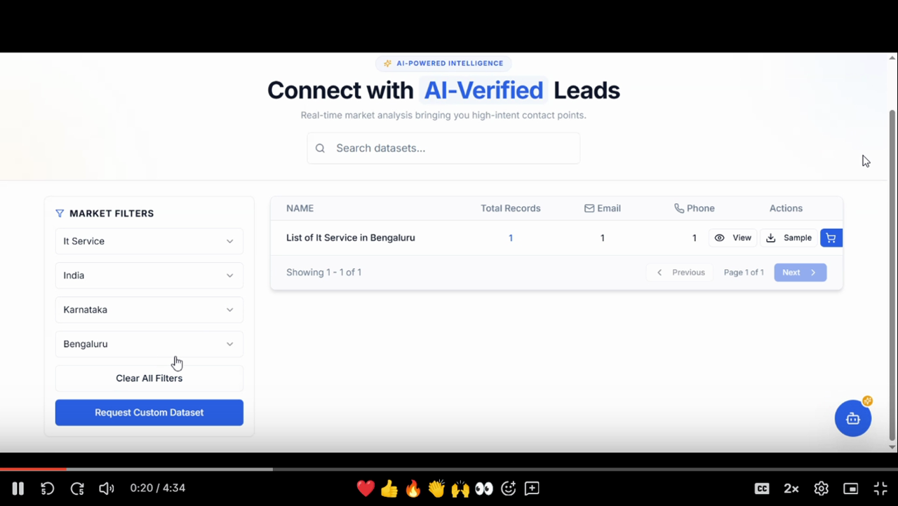

# B2B DataHub

A full-stack B2B lead data platform with:
- Public dataset browsing
- Admin dataset upload and management
- Custom fields support
- Order/payment ready backend flow

## Live URLs

- Frontend: https://b2-b-data-hub-ai-powered-lead-intelligence-platform-og0whjjtf.vercel.app  
- Frontend (alt): https://b2-b-data-hub-ai-powered-lead-intel.vercel.app  
- Admin panel: https://b2-b-data-hub-ai-powered-lead-intelligence-platform-og0whjjtf.vercel.app/admin  
- Backend API: https://b2b-datahub-ai-powered-lead-intelligence.onrender.com  
- Health check: https://b2b-datahub-ai-powered-lead-intelligence.onrender.com/health

## Demo Walkthrough

Click the preview below to watch the full walkthrough.

[](https://drive.google.com/file/d/17CvUx-Yff5QnrUqozVwKrwIqCZalQOFF/view?usp=sharing)

The walkthrough covers:
- Public dataset browsing
- Sign in and sign up flow
- Password reset flow
- Dataset detail and sample download
- Purchase / order request flow
- Admin login and dashboard
- Dataset upload, mapping, and custom fields
- Orders, customers, transactions, analytics, sales, and settings
- AI-powered insights and chat

## Run Locally

```bash
cp .env.example .env
cp Backend/.env.example Backend/.env
cp Frontend/.env.example Frontend/.env
docker compose up --build -d
```

- Frontend: http://localhost:8081
- Backend health: http://localhost:5001/health

## Demo Recording

Use this command to record the walkthrough locally:

```bash
BASE_URL=http://127.0.0.1:8081 RECORD_HEADLESS=true RECORD_VIDEO=true node scripts/record-demo.cjs
```
The recording and sample CSV are written under `output/playwright/`.

## Main APIs

- `GET /api/datasets`
- `GET /api/datasets/:id/records`
- `POST /api/auth/signup`
- `POST /api/auth/login`
- `POST /api/admin/manage-data/upload-data`
- `GET /api/admin/orders`

## Tech Stack

- Frontend: React, TypeScript, Vite, Tailwind CSS
- Backend: Node.js, Express, PostgreSQL, Multer, xlsx

## Notes

- This project is open-sourced under the MIT License. If you reuse it, keep the copyright notice and license text.
- `.env` files are required and are not committed.
- Keep `ADMIN_*` credentials in backend env for admin login.
- Do not commit private keys, real customer data, or production secrets to the public repo.
